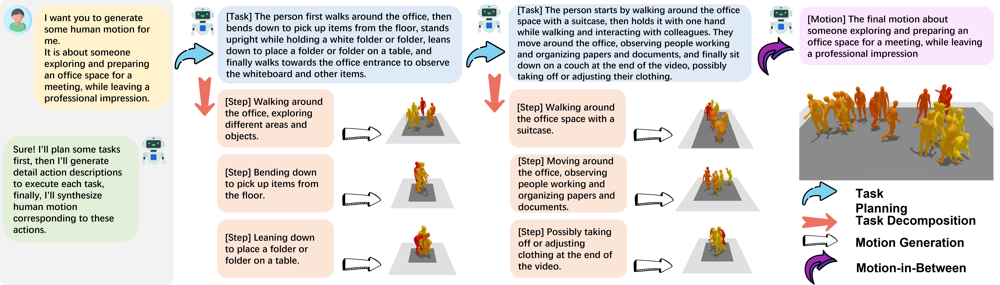

# Official implementation of "AvatarGPT: All-in-One Framework for Motion Understanding, Planning, Generation and Beyond"

### [Arxiv](https://arxiv.org/abs/2311.16468) | [Project Website](https://zixiangzhou916.github.io/AvatarGPT/)

💥💥💥 Our work is accepted by CVPR2024

⏩⏩⏩ Demo code and pretrained weights are released

---

## Abstract
#### Large Language Models(LLMs) have shown remarkable emergent abilities in unifying almost all (if not every) NLP tasks. In the human motion-related realm, however, researchers still develop siloed models for each task. Inspired by InstuctGPT, and the generalist concept behind Gato, we introduce ***AvatarGPT***, an All-in-One framework for motion understanding, planning, generations as well as other tasks such as motion in-between synthesis. AvatarGPT treats each task as one type of instruction fine-tuned on the shared LLM. All the tasks are seamlessly interconnected with language as the universal interface, constituting a closed-loop within the framework. To achieve this, human motion sequences are first encoded as discrete tokens, which serve as the extended vocabulary of LLM. Then, an unsupervised pipeline to generate natural language descriptions of human action sequences from in-the-wild videos is developed. Finally, all tasks are jointly trained. Extensive experiments show that AvatarGPT achieves SOTA on low-level tasks, and promising results on high-level tasks, demonstrating the effectiveness of our proposed All-in-One framework. Moreover, for the first time, AvatarGPT enables a principled approach by iterative traversal of the tasks within the closed-loop for unlimited long-motion synthesis.

## Overview

===

#### We use a VQ-VAE to quantize motion sequences to discrete tokens. We then align the discrete motion embeddings with the large language model embeddings through a light-weight adapter layer, we treat it as an extended vocabulary. We introduce separate large language model heads to decode text and motion tokens. It avoids sampling out-of-range tokens. We adopt an encoder-decoder architecture as our large language model and we use instruction fine-tuning as training strategy.
#### We also propose a novel dataset pipeline. Given a video, we first crop it to multiple short segments. We use a visual large language model to describe the content of each video segments. Then we use ChatGPT to produce textual annotations at various levels of detail from the content description. Our final annotation consists of three levels. The coarse-grained level describes the scene of the entire video, the medium-grained level describes the activity presented in each video segment, and the fine-grained level describes the specific actions in order to execute the activity.

## TODO
#### ✅ Release the demo code.
#### ✅ Release the pretrained weights and sample data.
#### ✅ Release the data curation pipeline. 
#### ⬜ Release the code for training, evaluation.

## Play with AvatarGPT
#### Prepare pretrained weights, the weights could be downloaded [here](https://drive.google.com/drive/folders/14TQCPLByNeXIixkPWCjLltSrIhP1JcE4?usp=sharing). After downloading, unzip the files, the weights will be placed under
    -- pretrained_models
        |-- avatar_gpt
        |-- human_models 
        |-- vqvae
    -- funcs
        |-- hml3d
    
#### You also need to download the pretrained T5 weights from [here](https://huggingface.co/google/flan-t5-large/tree/main), and place the downloaded files under
    -- pretrained_models
        |-- llm/flan-t5-large/tokenizer
        |-- llm/flan-t5-large/model

#### You can download sample data to run the demo from [sample data](https://drive.google.com/drive/folders/1byUsT4k8iieSf7AG7tVooXA8KaTPtpKf?usp=sharing). Unzip the file and the sample data will be placed under
    -- demo_inputs
        | test.txt
        | samples

#### You can run the following script to generate long motion sequences under certain scenario. It will also animate the generated motion.
    sh demo.sh

#### You can construct your own dataset for training high-level tasks. The data curation pipeline contains three steps: 

1. Download videos that match your demands.
2. Generate detail video content descriptions using [Ask-Anything](https://github.com/OpenGVLab/Ask-Anything). For convenience, we provide a sample video and you can follow [this](data_curation_pipeline/Ask-Anything/README.md) to setup the environment and run the model.
3. After the video content descriptions are prepared, you can generate descriptions of various level of granurality using [ChatGPT](https://openai.com/chatgpt) by following [this](data_curation_pipeline/ChatGPT/README.md). Please make sure you have a valid ChatGPT API key.

## Citation
@article{zhou2023avatargpt, \
$\qquad$  title={AvatarGPT: All-in-One Framework for Motion Understanding, Planning, Generation and Beyond}, \
$\qquad$  author={Zhou, Zixiang and Wan, Yu and Wang, Baoyuan}, \
$\qquad$  journal={arXiv preprint arXiv:2311.16468}, \
$\qquad$  year={2023} \
}